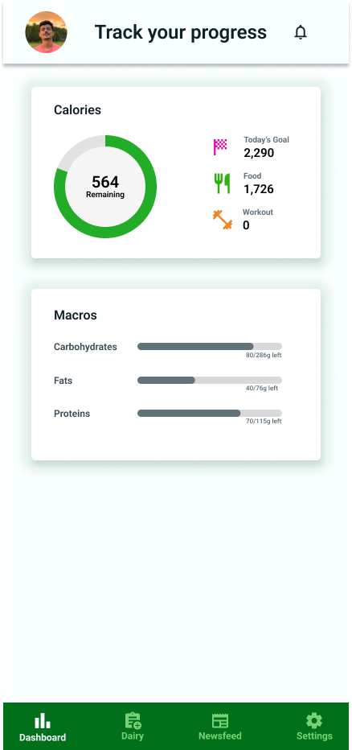
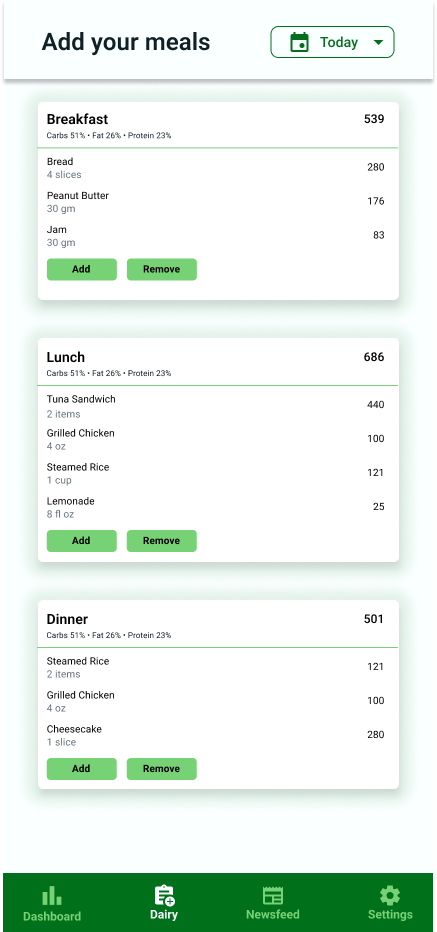

# Calorie Manager

### Introducing the Ultimate Meal Tracking App
Achieve your health and fitness goals with ease using our comprehensive meal tracking app. Our app makes it easy to track your daily calorie and macronutrient intake, ensuring you stay on track with your goals.

### Intuitive Dashboard
Check your calorie intake at a glance with our intuitive dashboard, making it easy to make informed decisions about your meals.

### Track Your Macronutrient Intake
Track your macronutrient intake (carbohydrates, proteins, and fats) in one go, helping you ensure you are getting the right balance of nutrients.

### Add Food Items Before You Eat
Add food items to your meals before you eat, so you can stay accountable and on track with your goals.

### Extensive Food Database
With our extensive food database of 10,000+ food and beverage items, it's easy to find and log the foods you are eating, saving you time and improving accuracy.

### Newsfeed
Find fitness-related blogs and videos on our newsfeed feature to provide you with additional resources and inspiration to help you achieve your goals.

### Screenshots

   
  
  

